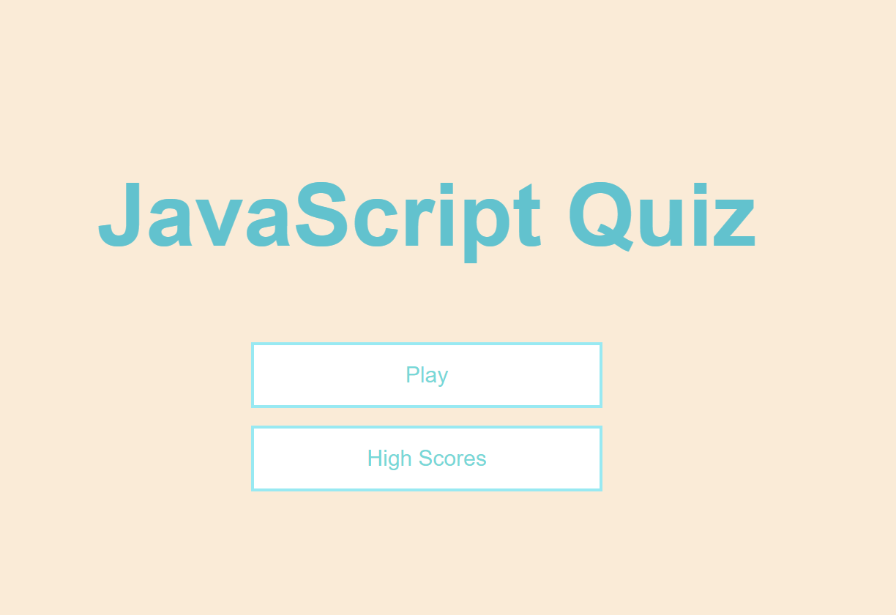

# JavaScript-Quiz

Small quiz to test your knowledge on JavaScript made using JavaScript!

## Description 

Contains 5 questions to help you practice or test your knowledge on JavaScript. Save your highscore locally and allows you to view a leaderboard.

## Usage

Test how much you know about certain aspects of JavaScript

## Dependencies

1. A web browser
2. Internet
3. <a href="https://mscott-dev.github.io/JavaScript-Quiz/" alt="javaScript">A link to the webpage</a>

## Installing
N/A

## Executing program

Click play, answer questions, and save your highscore! See who can get the top spot on the leaderboard!

## Authors
Matthew Scott
